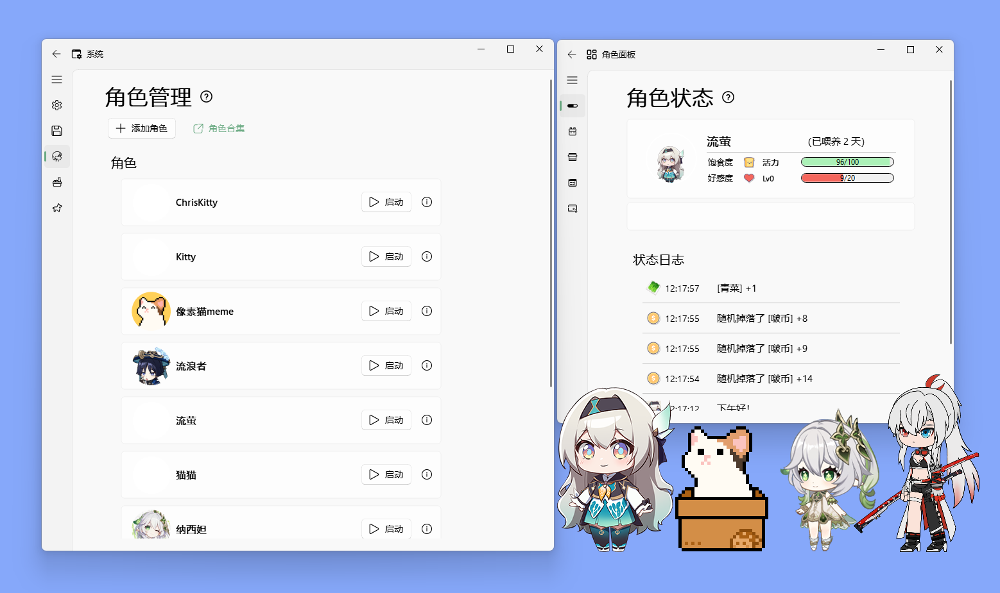
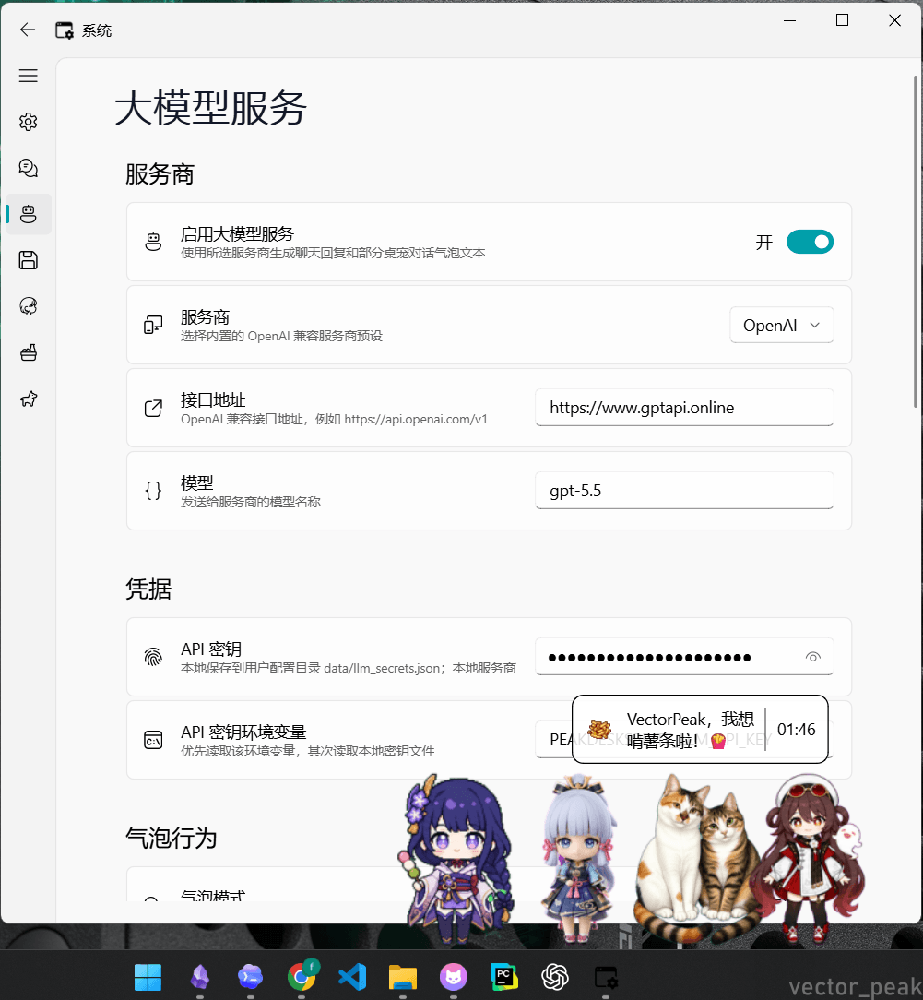
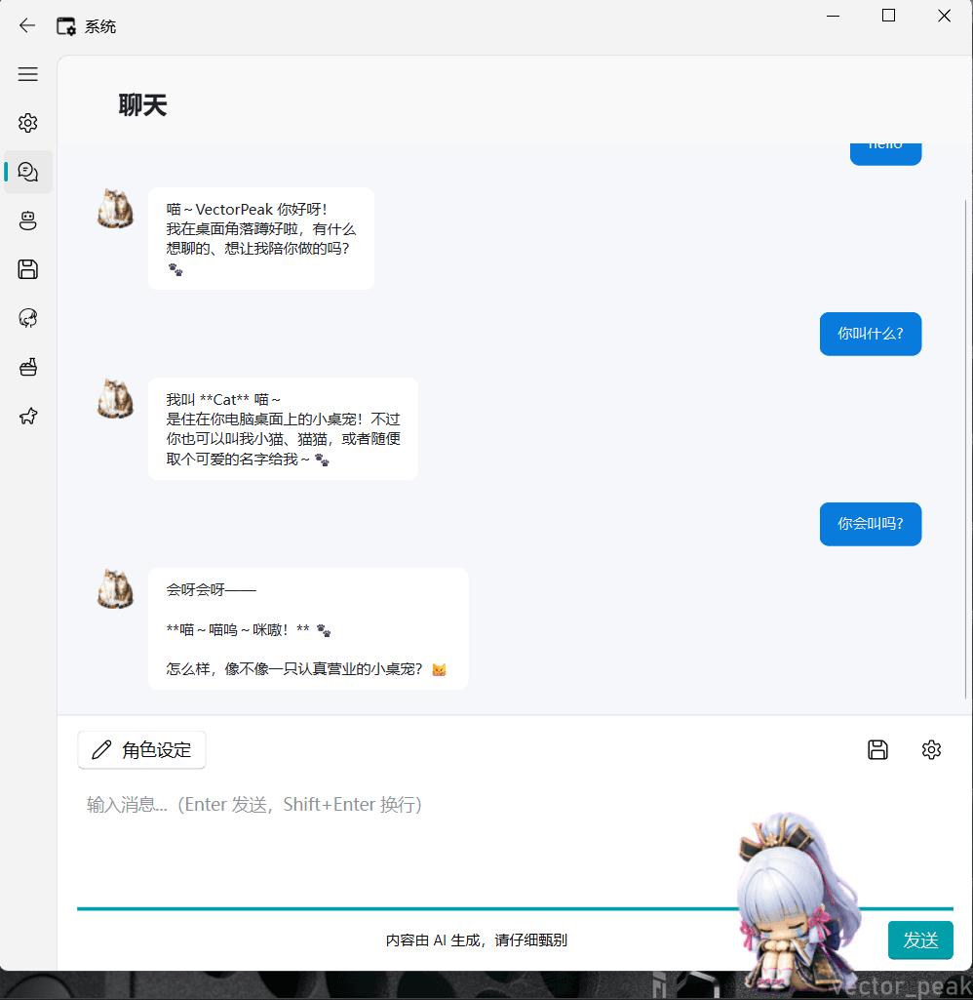
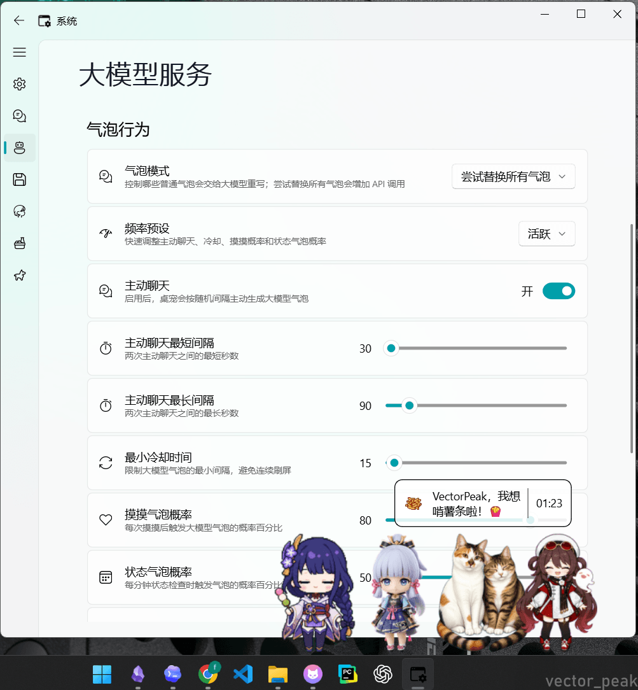
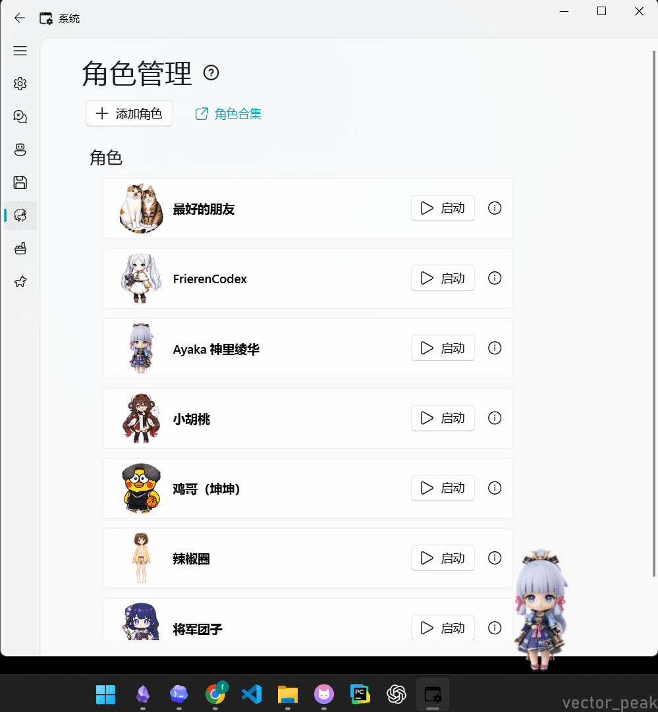
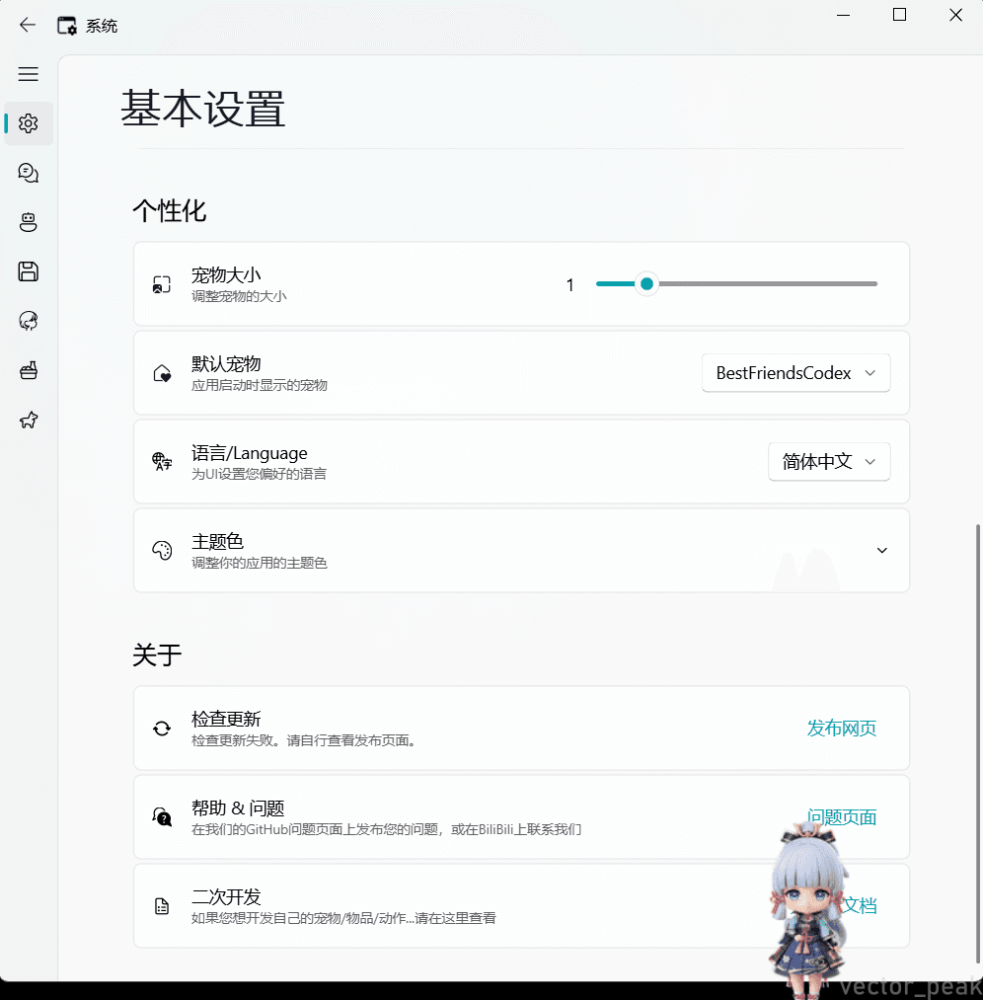

<h1 align="center">
  CodexPetLive
</h1>

<p align="center">
  A Windows desktop runtime that brings Codex-generated pets to life
</p>

<p align="center">
  <a>
    
  </a>
  <a style="text-decoration:none">
    
  </a>
  <a style="text-decoration:none">
    
  </a>
</p>

<p align="center">
  简体中文 | <a href="README_EN.md">English</a>
</p>

## 项目简介

Codex 生成的 Pet，不应该只躺在素材包里

CodexPetLive 是一个面向 Codex Pet 的 Windows 桌面运行时。它可以把 Codex 生成的 hatch-pet 角色包转换成真正可运行的桌面宠物：能在桌面上待机、移动、切换动作、响应互动，也能接入气泡、状态、背包、角色管理、设置面板和可选的 LLM 聊天能力

你可以把 Codex 理解成“角色孵化器”，把 CodexPetLive 理解成“桌面舞台”。Codex 负责生成角色，CodexPetLive 负责让角色从文件夹里走出来，变成一个可以陪伴、可以交互、可以继续扩展的桌面角色

这个项目底层基于 CodexPetLive / PySide6 桌宠框架，既适合展示 AI 生成角色，也适合制作桌面陪伴应用、验证角色素材、开发桌宠玩法，或者把一个简单的 Pet 包继续扩展成完整的桌面体验

如果你喜欢这个桌宠程序，请点击右上角的 ⭐ Star，这对我们有很大的激励

## Why CodexPetLive

因为“生成一个角色”和“真正拥有一个角色”之间，还差一个桌面运行时

Codex Pet 负责把角色孵化出来，但素材包本身不会自己动起来，也不会自己处理点击、拖拽、气泡、状态、背包、设置和聊天。CodexPetLive 补上的就是这最后一公里：把 AI 生成的 Pet 从文件夹、预览图和素材表里带到真实桌面上

它更像一座舞台，而不是又一个素材仓库。角色可以被切换、被互动、被继续扩展；开发者也可以基于同一套 PySide6 桌宠框架，把 Codex Pet 接到更完整的桌面体验里

如果说 Codex 让角色诞生，CodexPetLive 就让角色开始陪你工作

## 效果演示

桌宠可以常驻桌面底部，也可以和设置面板、角色管理、LLM 气泡和聊天界面一起工作。下面这些截图展示的是当前桌面运行时和控制面板的主要体验



<table>
  <tr>
    <th width="50%">大模型服务与气泡</th>
    <th width="50%">聊天面板</th>
  </tr>
  <tr>
    <td></td>
    <td></td>
  </tr>
  <tr>
    <td>配置 OpenAI-compatible 服务商、接口地址、模型名、API Key 和环境变量读取策略</td>
    <td>角色聊天界面支持上下文消息、角色设定入口、聊天记录保存和 AI 内容提示</td>
  </tr>
  <tr>
    <th>气泡行为</th>
    <th>角色管理</th>
  </tr>
  <tr>
    <td></td>
    <td></td>
  </tr>
  <tr>
    <td>调整气泡模式、主动聊天、冷却时间、摸摸气泡概率和状态气泡概率</td>
    <td>添加、切换和启动不同角色，角色素材可以通过资源目录或导入流程扩展</td>
  </tr>
</table>

| 基本设置 |
| --- |
|  |
| 调整宠物大小、默认宠物、界面语言、主题色，并访问更新、问题反馈和二次开发入口 |

## How to use CodexPetLive

如果你只是想先把桌宠跑起来，下载 Windows 发布包，解压后双击 `CodexPetLive.exe`。桌宠会出现在桌面上，你可以在设置面板里切换角色、调整大小、修改气泡行为、配置 LLM 服务，或者把它当作一个日常陪伴型桌面应用使用

如果你想体验 Codex Pet，可以先去 [Codex Pets](https://codex-pets.net/) 下载喜欢的宠物包。一个标准的 hatch-pet 包通常包含 `pet.json` 和 `spritesheet.webp`，它们分别描述宠物元数据和动画图集

拿到宠物包后，用 CodexPetLive 的转换工具把它变成桌面角色模块：

```powershell
python tools\hatchpet_to_peakdesk.py convert `
  --input C:\Path\To\codex-pet-package `
  --out-dir res\role\YourPetName `
  --role-name YourPetName `
  --overwrite
```

转换完成后重新启动 CodexPetLive，在角色管理里选择这个新角色即可。完整转换流程、图集规格和动作映射见 [HatchPet 转换说明](docs/hatchpet_converter.md)

## Quick Start

### Windows 用户

当前最新版本是 [CodexPetLive v0.8.6](https://github.com/VectorPeak/CodexPetLive/releases/tag/v0.8.6)，Windows 发布包为 `CodexPetLive-v0.8.6-windows-x64.zip`

下载 zip 后解压，双击 `CodexPetLive.exe` 启动。`v0.8.5` 是更名前发布的历史版本，所以旧包名和旧 exe 名仍会出现在历史 Release 资产里

开发者如果需要自己构建 Windows zip 包，请参考 [Windows 发布清单](docs/release_checklist.md)

### 从源码运行

推荐使用 Python 3.12 环境运行源码版本；如果本机 PySide6 / Qt DLL 兼容性不稳定，也可以退回 Python 3.9。项目现在只保留一个 [requirements.txt](requirements.txt)，它同时服务源码运行和 Windows release 构建：

```txt
apscheduler
pynput
PyInstaller>=6.19,<7.0
PySide6>=6.10,<6.12
PySide6-Fluent-Widgets>=1.10,<2.0
tendo
Pillow>=11.0,<13.0
```

安装和启动示例：

```powershell
conda create --name CodexPetLive_pyside python=3.12 -y
conda activate CodexPetLive_pyside
python -m pip install -r requirements.txt
python -m CodexPetLive
```

如果本机已经安装了兼容的 Python 3.12，也可以使用虚拟环境：

```powershell
py -3.12 -m venv .venv
.\.venv\Scripts\Activate.ps1
python -m pip install -r requirements.txt
python -m CodexPetLive
```

`Pillow>=11.0,<13.0` 表示 Pillow 的版本范围是 11.x 到 12.x，不是只能安装某一个精确版本。实际安装时 pip 会在这个范围内选择兼容版本

## 项目架构

CodexPetLive 的主线可以分成三层：最外层是用户能看到的透明 Qt 窗口和控制面板，中间层是动作、通知、背包、任务、LLM 等运行时功能，最内层是角色素材、配置文件和本机运行态数据

桌面宠物可以理解为一个“透明窗口上的状态机”：用户看到的是角色在桌面上移动、跳跃、互动，程序内部则在持续处理状态、事件、定时器和资源配置。从工程上看，它大致是 `桌面宠物 = Qt 窗口 + 动画帧 + 行为状态机 + 用户数据 + 事件响应`

<table>
  <thead>
    <tr>
      <th width="180" nowrap>类别</th>
      <th width="260">模块</th>
      <th>说明</th>
    </tr>
  </thead>
  <tbody>
    <tr><td width="180" nowrap>启动与应用生命周期</td><td><code>CodexPetLive/__main__.py</code></td><td>创建 <code>QApplication</code>，加载宠物、通知、附件、系统面板、仪表盘，并通过 Qt Signal 把它们连接起来</td></tr>
    <tr><td width="180" nowrap>启动与应用生命周期</td><td>单实例控制</td><td>使用 <code>tendo.singleton.SingleInstance()</code> 防止重复启动；如果已有实例，后启动的进程会静默退出</td></tr>
    <tr><td width="180" nowrap>启动与应用生命周期</td><td>多屏与午夜定时器</td><td>启动时读取屏幕列表，优先主屏，并设置跨日定时器，用于触发日常状态或事件刷新</td></tr>
    <tr><td width="180" nowrap>桌面宠物运行时</td><td><code>CodexPetLive/CodexPetLive.py</code></td><td>主宠物窗口和运行时协调器，负责角色显示、动作切换、状态变化、鼠标交互和信号分发</td></tr>
    <tr><td width="180" nowrap>桌面宠物运行时</td><td>动画动作系统</td><td>角色动作由 <code>act_conf.json</code> 与 <code>pet_conf.json</code> 配置，PNG 序列帧负责实际视觉表现</td></tr>
    <tr><td width="180" nowrap>桌面宠物运行时</td><td>交互行为</td><td>支持点击、拖拽、跟随、掉落、拍打、专注动作等桌宠常见行为</td></tr>
    <tr><td width="180" nowrap>角色与素材系统</td><td><code>res/role</code></td><td>角色主要放在这里，每个角色通常包含 <code>pet_conf.json</code>、<code>act_conf.json</code>、<code>action/*.png</code>、<code>info</code> 等内容</td></tr>
    <tr><td width="180" nowrap>角色与素材系统</td><td><code>res/pet</code></td><td>兼容旧的迷你宠物结构，说明项目经历过从宠物素材到角色模块的结构演进</td></tr>
    <tr><td width="180" nowrap>角色与素材系统</td><td><code>CodexPetLive/conf.py</code></td><td>负责读取角色、动作、物品、存档等配置，是项目的领域配置核心</td></tr>
    <tr><td width="180" nowrap>通知与气泡</td><td><code>CodexPetLive/Notification.py</code></td><td>管理弹窗通知、气泡显示、日志转发等</td></tr>
    <tr><td width="180" nowrap>通知与气泡</td><td><code>CodexPetLive/bubbleManager.py</code></td><td>管理不同事件触发的对话气泡，例如饱食度、好感度、点击、专注等</td></tr>
    <tr><td width="180" nowrap>通知与气泡</td><td>LLM 气泡接入</td><td>气泡系统可以在特定事件下请求 LLM 生成短文本，再回填到桌宠气泡中</td></tr>
    <tr><td width="180" nowrap>附件与子宠物</td><td><code>CodexPetLive/Accessory.py</code></td><td>管理装饰物、掉落物、子宠物、鼠标装饰等窗口对象</td></tr>
    <tr><td width="180" nowrap>附件与子宠物</td><td>子宠物跟随</td><td>子宠物可以跟随主宠物、关闭跟随、回收或独立显示，是“主角色 + 附属对象”的扩展模型</td></tr>
    <tr><td width="180" nowrap>仪表盘功能</td><td><code>CodexPetLive/Dashboard/DashboardUI.py</code></td><td>提供状态、背包、商店、每日任务、动画管理几个页签</td></tr>
    <tr><td width="180" nowrap>仪表盘功能</td><td>状态与 Buff</td><td>状态页显示 HP、FV、金币、Buff 等，背包物品可以影响这些状态</td></tr>
    <tr><td width="180" nowrap>仪表盘功能</td><td>背包与商店</td><td>背包管理物品，商店负责购买和出售，二者通过信号同步金币和物品数量</td></tr>
    <tr><td width="180" nowrap>仪表盘功能</td><td>任务与专注</td><td>任务页包含番茄钟、专注时间、进度任务、每日任务，并可以发放金币奖励</td></tr>
    <tr><td width="180" nowrap>系统设置面板</td><td><code>CodexPetLive/SpriteSettings/SpriteControlPanel.py</code></td><td>系统设置主窗口，包含设置、聊天、大模型服务、存档、角色、物品 MOD、迷你宠物等页签</td></tr>
    <tr><td width="180" nowrap>系统设置面板</td><td><code>CharCardUI.py</code></td><td>负责角色导入、切换和卡片展示</td></tr>
    <tr><td width="180" nowrap>系统设置面板</td><td><code>ItemCardUI.py</code></td><td>负责物品 MOD 管理</td></tr>
    <tr><td width="180" nowrap>系统设置面板</td><td><code>GameSaveUI.py</code></td><td>支持存档、读取、回退和删除</td></tr>
    <tr><td width="180" nowrap>LLM 功能</td><td><code>CodexPetLive/llm_client.py</code></td><td>内置 OpenAI、DeepSeek、Ollama、Custom 四类 OpenAI-compatible Provider 预设</td></tr>
    <tr><td width="180" nowrap>LLM 功能</td><td><code>LLMChatUI.py</code></td><td>提供宠物聊天界面，支持保存聊天记录</td></tr>
    <tr><td width="180" nowrap>LLM 功能</td><td>安全边界</td><td>API Key 优先从环境变量读取，也可以保存到运行时数据目录的 <code>llm_secrets.json</code></td></tr>
    <tr><td width="180" nowrap>打包与工具</td><td><code>tools/</code></td><td>包含 HatchPet 转换辅助，用于把其他宠物素材转换成 CodexPetLive 结构</td></tr>
    <tr><td width="180" nowrap>打包与工具</td><td><code>docs/</code></td><td>包含源码结构、依赖结构、素材开发、发布清单等开发文档</td></tr>
  </tbody>
</table>

更详细的源码结构和依赖关系可以阅读 [源码结构说明](docs/source_architecture.md) 与 [依赖结构图](docs/source_dependency_map.md)

## 配置

项目配置大致分为三类：仓库内的默认资源配置、本机运行态配置、以及可选的 LLM 服务配置

| 类型 | 位置 | 说明 |
| --- | --- | --- |
| 默认角色与素材 | `res/role`、`res/pet`、`res/icons` | 随项目分发，包含角色动作、头像、气泡、图标、物品等默认资源 |
| 角色动作配置 | `pet_conf.json`、`act_conf.json` | 描述角色基础属性、动作集合、帧刷新、移动、锚点和触发条件 |
| 运行态配置 | Windows 下默认位于 `%APPDATA%\CodexPetLive` | 存放用户设置和运行态数据；可以通过 `CODEXPETLIVE_CONFIG_DIR` 覆盖 |
| 运行态数据 | `%APPDATA%\CodexPetLive\data` | 存放 `settings.json`、`pet_data.json`、`act_data.json`、`task_data.json` 等用户数据 |
| LLM API Key | 环境变量 `CODEXPETLIVE_LLM_API_KEY` 或 `llm_secrets.json` | 环境变量优先，未配置时才读取本机运行态数据目录里的密钥文件 |
| LLM 聊天记录 | `llm_chat_history.json` | 保存在本机运行态数据目录，不应提交到公开仓库或公开 issue |

如果要开发新的宠物形象、动作、道具或迷你宠物，请先阅读 [素材开发文档](docs/art_dev.md) 和 [HatchPet 转换说明](docs/hatchpet_converter.md)

如果要修改运行时、设置面板、通知、背包、LLM 或发布流程，请先阅读 [源码结构说明](docs/source_architecture.md)、[依赖结构图](docs/source_dependency_map.md) 与 [Windows 发布清单](docs/release_checklist.md)

## 常见问题

### 这是一个网页项目吗

不是。CodexPetLive 是 PySide6 桌面 GUI 应用，启动后显示的是桌面窗口、系统面板和托盘相关交互，不会提供 localhost 网页地址

### 为什么示例推荐 Python 3.12

当前 `requirements.txt` 已经合并源码运行和 Windows release 构建依赖，并约束在 PySide6 6.10 系列，发布清单也以独立 Python 3.12 虚拟环境作为默认构建环境。Qt 桌面应用对 Python、PySide6 和本机 DLL 兼容性比较敏感；如果某台机器上 Python 3.12 遇到 QtCore 等动态库加载问题，可以退回 Python 3.9 做源码运行验证

### `Pillow>=11.0,<13.0` 是什么意思

这是版本范围，含义是安装 Pillow 11.0.0 或更高版本，但低于 13.0。它不是精确锁定版本，也不表示必须手动安装某个固定版本。Pillow 主要用于图片读取、处理和素材相关流程

### 为什么启动第二次没有反应

项目使用 `tendo.singleton.SingleInstance()` 做单实例保护。如果已经有一个 CodexPetLive 进程在运行，后启动的进程会退出，避免桌面上同时出现多个互相争用配置和资源的实例

### LLM 会把哪些内容发给服务商

LLM 功能是可选功能。启用后，桌宠会把用户输入、必要的聊天上下文、角色提示词和事件文本发送到用户配置的 LLM 服务商。API Key 优先从环境变量读取，也可保存在本机运行态配置目录，聊天记录保存在本机运行态数据目录

请不要在公开 issue、日志、截图或 PR 中粘贴 API Key、聊天记录、服务商返回体或未脱敏的本机路径

### 素材授权需要注意什么

项目代码遵循仓库内的 [LICENSE](LICENSE)。默认素材、示例素材、第三方角色/物品模组、外部字体/图标/音频和用户自行导入的素材可能有独立授权边界。分发或二次创作前，请自行确认素材来源与授权条件

## 开发者文档与贡献边界

公开仓库欢迎以下类型的贡献：

- 反馈桌宠启动、资源加载、角色导入、背包、通知或设置面板问题
- 补充角色、物品模组、迷你宠物、文档示例或截图说明
- 修复路径兼容、发布包审计、资源定位、UI 行为和 smoke test 问题
- 讨论 LLM 聊天、角色气泡、上下文管理和本地隐私边界

提交代码前请尽量保持 PR 聚焦，一次解决一个明确问题。涉及 API Key、聊天记录、服务商返回体、本机绝对路径或其他隐私信息时，请先完成脱敏；安全或隐私相关问题建议优先通过私下渠道联系维护者

CodexPetLive 的定位不是一个只绑定某个形象的小程序，而是一个可以不断换衣服、换动作、换道具、换性格的桌宠底座。使用者可以把它当作桌面陪伴应用，素材作者可以把它当作角色素材实验室，开发者则可以把它当作交互 Demo 原型或轻量桌面工具的起点

## 致谢

- 基于 [ChaozhongLiu/DyberPet](https://github.com/ChaozhongLiu/DyberPet) 底座进行二次开发
- UI 重构基于 [Fluent-Widgets](https://github.com/zhiyiYo/PyQt-Fluent-Widgets)，感谢作者 [zhiyiYo](https://github.com/zhiyiYo) 的指导和帮助
- Demo 中的部分素材来自 [daywa1kr](https://github.com/daywa1kr/Desktop-Cat)
- 框架早期的动画模块逻辑参考了 [yanji255](https://toscode.gitee.com/yanji255/desktop_pet/)
- 框架拖拽掉落的计算逻辑参考了 [WolfChen1996](https://github.com/WolfChen1996/DesktopPet)
